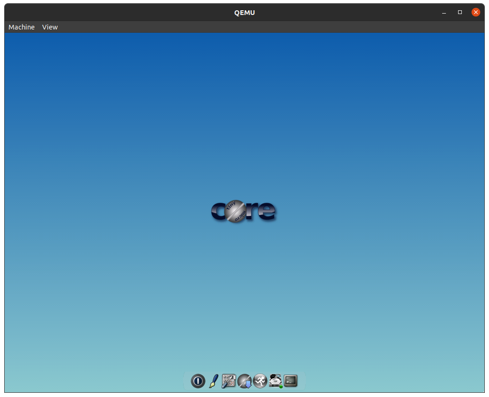

# tinycloud - tinycore and cloud-init

Adaptation of [Tiny Core Linux](http://tinycorelinux.net/), to add `#cloud-config` support for [Lima](https://lima-vm.io/).

The cloud-init script is from: <https://github.com/afbjorklund/tinycloudinit>


Variants:

`20M	CorePure64-15.0.iso` (CLI)

`33M	TinyCorePure64-15.0.iso` (GUI)



Components:

- Glibc 2.38

- Linux 6.6.5

- Busybox 1.36.1

Packages:

`acpid.tcz bash.tcz coreutils.tcz util-linux.tcz udev-extra.tcz e2fsprogs.tcz openssh.tcz sshfs.tcz`

Note: the `acpid` daemon allows powering down the system, using ACPI.

Dep Tree (`.tree`):

```
acpid.tcz

bash.tcz
   readline.tcz
      ncursesw.tcz

coreutils.tcz
   gmp.tcz

util-linux.tcz
   readline.tcz
      ncursesw.tcz
   udev-lib.tcz

udev-extra.tcz
   pciutils.tcz
      libpci.tcz
   usb-utils.tcz
      libusb.tcz
         udev-lib.tcz

e2fsprogs.tcz

openssh.tcz
   openssl.tcz

sshfs.tcz
   fuse3.tcz
   glib2.tcz
      libffi.tcz
      pcre21042.tcz
   openssh.tcz
      openssl.tcz
```

Package Info (`.info`):

```
Title:          acpid.tcz
Description:    acpid daemon
Version:        2.0.32
...
Title:          bash.tcz
Description:    bash shell
Version:        5.2.21
...
Title:          coreutils.tcz
Description:    core utilities
Version:        9.4
...
Title:          util-linux.tcz
Description:    linux tools
Version:        2.39.3
...
Title:          udev-extra.tcz
Description:    additional udev tools
Version:        174
...
Title:		openssh.tcz
Description:	openssh client and server
Version:	9.5p1
...
Title:          sshfs.tcz
Description:    ssh filesystem client
Version:        3.7.0
```

Package Size:

```
36K	acpid.tcz
540K	bash.tcz
2.4M	coreutils.tcz
484K	e2fsprogs.tcz
88K	fuse3.tcz
1.6M	glib2.tcz
252K	gmp.tcz
16K	libffi.tcz
24K	libpci.tcz
48K	libusb.tcz
252K	ncursesw.tcz
1.8M	openssh.tcz
2.9M	openssl.tcz
276K	pciutils.tcz
672K	pcre21042.tcz
148K	readline.tcz
28K	sshfs.tcz
100K	udev-extra.tcz
24K	udev-lib.tcz
288K	usb-utils.tcz
1.6M	util-linux.tcz
14M	total
```

## Packages

To install .tcz packages, use the regular 'tc' user:

```console
anders@lima-core:~$ sudo -i tc
^
   ( '>')
  /) TC (\   Core is distributed with ABSOLUTELY NO WARRANTY.
 (/-_--_-\)           www.tinycorelinux.net

tc@lima-core:~$
```

Then you will have access to the regular tce commands.

---

White Cloud image credit: Designed by macrovector / [Freepik](http://www.freepik.com)
